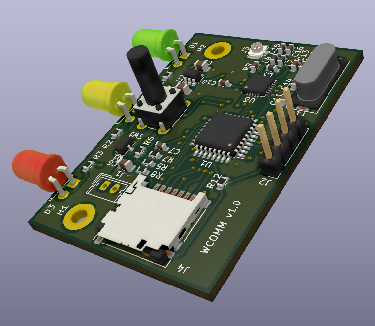

# TR-WCOMM
This is a electronics and firmware project for a file transmission device based on STM32L051 MCU and NRF24L01+ Transceiver. It's goal is to be small, low power, easy to use, easy to manufacture and to be able to send files over a outdoors distance of at least 100m. 


## What is looks like and how it works

The device is a small PCB with three LEDs in green, yellow and blue, a push button, a SD Card socket and a U.FL antenna connector. There is space for mounting a battery connector ou  directly soldering battery leads to the PCB.



Once there is power, the user must connect the antenna and the SD Card press once the push button. All three leds will flash thrice, indicating that the device is on. Then, the user can press the button briefly (<1s) to activate the file transmission. Another identical device can be used to receive the file. If the user presses the button for more than 3s, it will power off, flashing all leds 4 times.

By default, it will send the file "data.dat" at the root of the SD Card, but if user implements the file "wcomm.cfg" at the root of the SD Card, the name of the transmitted file, along with some other configuration, can be changed.

### wcomm.cfg file example

```
Example wcomm.cfg
file = myfile.bin
dest = 12345
addr = 23568
ch = 10
```

### wcomm.cfg attributes

|Attribute  |Meaning                                            |
|:---------:|:-------------------------------------------------:|
|file       |Name of the file to be sent.                       |
|dest       |Destination address, up to 5 characters.           |
|addr       |Device address for reception, up to 5 characters.  |
|ch         |Channel to transmit and receive, 0-127.            |

### LED Functions

Each led will flash in response to a successul operation, a warning or an error.

|LED Color  |Meaning                                                                                  |
|:---------:|:---------------------------------------------------------------------------------------:|
|Green      |A successful operation has been completed, or the device is in a safe working condition. |
|Yellow     |There has been an error but the device has recovered, or the battery is weak.            |
|Red        |There has been an unrecoverable error (eg. SD Card failure)                              |
|ch         |Channel to transmit and receive, 0-127             |

## Project Structure

The electronic schematics and board layout are located at the directory "Circuit" and the firmware code is located at the directory "Firmware". The electronic design was made with KiCad 5.1.12. The firmware design was made with STM32CubeIDE 1.9.0 and can be easily built with it. The firmware structure is further divided:

|Firmware Folder| Contents                                                                               |
|:-------------:|:--------------------------------------------------------------------------------------:|
|Application    |The main application code, with the vast majority of code writen by me.                 |
|Core           |Device initialization code generated automatically by STM32CubeIDE  .                   |
|Drivers        |Device drivers generated automatically by STM32CubeIDE.                                 |
|FATFS          |FatFs library diskio functions, mostly generated automatically by STM32CubeIDE.         |
|Middlewares    |Middleware code generated by STM32CubeIDE.                                              |

## Principles of working

The device power is expected to be fed by a 3.7 V battery. This voltage is regulated to 3.3 V to power all the board. A transistor connected to both a MCU pin and the push button allows power to flow from the battery to the rest of the circuit. The device is built around a STM32L051 MCU. The SD Card and the NRF24L01+ share the same SPI bus.

The main firmware part is written in C++ and uses a simple cooperative task architecture with methods Setup() and Loop(). Once the method Setup() of all tasks is called, the core proceeds to call every Loop() function forever. Usually, inside every Loop() function, a state-machine is build using switch statements.

The firmware is divided in two parts: drivers and applications. The drivers abstract the hardware in a modular way, exposing easy to use methods for each device. The applications make use of drivers to produce useful output.

### Drivers Description

|Driver         | Description                                                                            |
|:-------------:|:--------------------------------------------------------------------------------------:|
|Battery        |Samples battery voltage and inform other tasks when it is too low.                      |
|Leds           |Controls the LEDs operation.                                                            |
|NRF24L01p      |Setups and controls NRF24L01+ Transceiver IC.                                           |
|Power          |Provide useful functions for low-power sleep and shutdown.                              |
|SpiManager     |Manages the shared SPI bus between SD Card and NRF24L01+.                               |

### Applications Description

|Application    | Description                                                                            |
|:-------------:|:--------------------------------------------------------------------------------------:|
|Control        |Controls the main functionality of the device: file transmission and power.             |
|Main           |Simple task scheduler.                                                                  |
|SDCard         |Provides abstraction to SD Card access to files.                                        |
|TaskInterface  |Provides a standard interface for tasks to inherit from.                                |
|Tasks          |List of tasks.                                                                          |
|TickTimer      |Simple, easy to use, timer to measure milliseconds ticks.                               |

### Low Power Features

The device features a low power oriented design. The SD Card can be turned off by a transistor to save power, and the microcontroller will go to low power stop mode when in idle state, waking up every 3 seconds, listening for any data for 1 second, and then going low power again. The NRF24L01+ Transceiver was choosen for being design-proven, flexible and, most important, low power.


